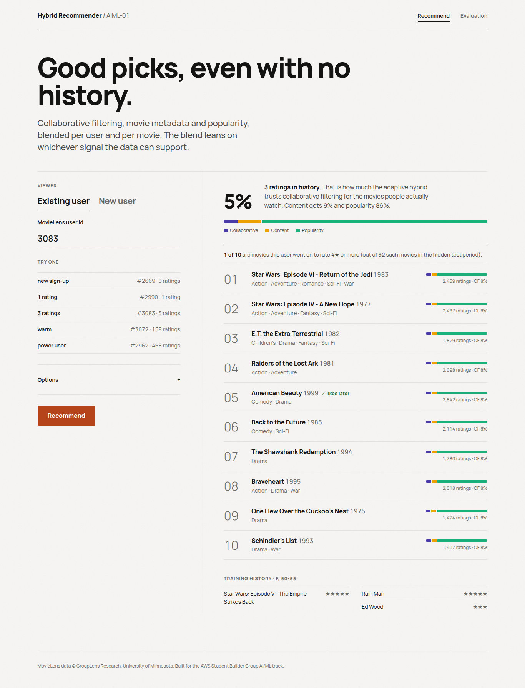
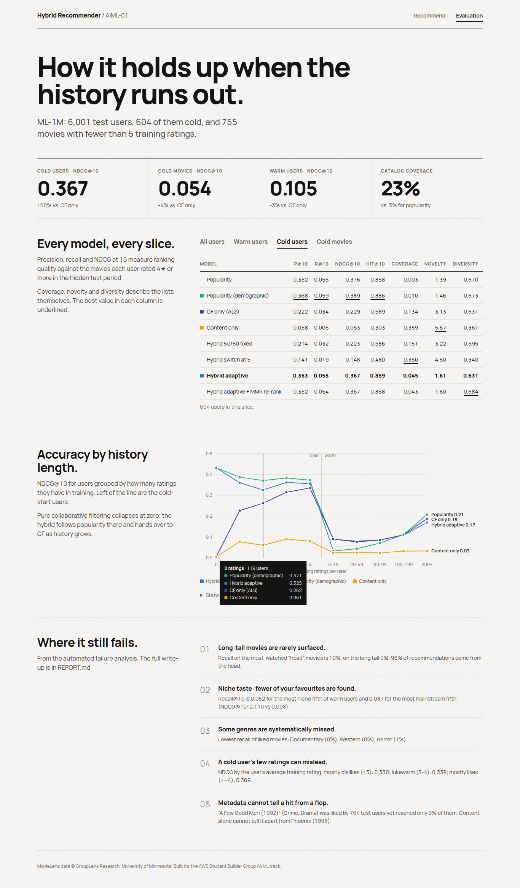

# Hybrid Recommendation Engine with Cold-Start Handling

**AWS Student Builder Group · AI/ML · AIML-01**

A movie recommender for MovieLens that blends **collaborative filtering**
(matrix factorization with ALS), **content-based filtering** (genres, decade,
title/tag text embeddings) and **popularity**. Every user-movie pair gets its
own blend weights, which shift towards content and popularity as the user's
or the movie's interaction history thins out. New users and new movies get
gracefully worse recommendations instead of broken ones.

* **Write-up:** [`REPORT.md`](REPORT.md) (approach, key decisions, results, failure analysis)
* **Study guide:** [`docs/LEARN.md`](docs/LEARN.md) (every file and formula in plain words, plus likely reviewer questions)
* **Full results:** [`results/results_ml-1m.md`](results/results_ml-1m.md) · [`results/failure_analysis_ml-1m.md`](results/failure_analysis_ml-1m.md)
* **Web app:** explore recommendations and results in the browser (screenshots below)

## Results at a glance (MovieLens 1M, NDCG@10, held-out test set)

| Model | All users | Warm users | Cold users (< 5 ratings) | Cold movies (< 5 ratings) | Worst slice vs. best |
|---|---:|---:|---:|---:|---:|
| Popularity (demographic) | 0.124 | 0.094 | **0.389** | 0.018 | 0.32 |
| CF only (ALS) | 0.120 | **0.108** | 0.229 | **0.056** | 0.59 |
| Content only | 0.031 | 0.028 | 0.063 | 0.050 | 0.16 |
| Hybrid, fixed 50/50 | 0.105 | 0.092 | 0.223 | 0.051 | 0.57 |
| Hybrid, hard switch at 5 | 0.111 | 0.107 | 0.148 | 0.050 | 0.38 |
| **Hybrid, adaptive (ours)** | **0.131** | 0.105 | 0.367 | 0.054 | **0.94** |
| Adaptive + MMR re-rank (bonus) | **0.134** | **0.108** | 0.367 | – | – |

*Worst slice vs. best* = the model's lowest score across the warm, cold-user
and cold-movie slices, as a share of the best model on that slice. Every
single-signal model collapses somewhere: CF scores 0.006 for brand-new
users, popularity 0.018 on new movies. The adaptive hybrid never drops below
94% of the best model on any slice, and it is the best overall. Details,
precision/recall/hit-rate/coverage/novelty/diversity and per-history
breakdowns are in [`results/results_ml-1m.md`](results/results_ml-1m.md).


## How it works (30 seconds)

```
c_user = n_user / (n_user + k_user)       CF trust in the user's vector
c_item = n_item / (n_item + k_item)       CF trust in the movie's vector
t_user = n_user / (n_user + k_content)    trust in the user's content profile

w_cf   = c_user · c_item
w_cb   = (1 − w_cf) · t_user              what CF can't cover goes to content…
w_pop  = (1 − w_cf) · (1 − t_user)        …and what content can't cover to popularity

score  = w_cf · CF + w_cb · Content + w_pop · Popularity   (each signal z-scored per user)
```

A brand-new user gets 100% popularity (by age and gender). A movie
released yesterday gets no CF weight. A long-time user on a well-known
movie gets mostly CF. The three `k` values ("ratings until we trust it 50%")
are tuned on a validation split. See [`REPORT.md`](REPORT.md) for why this
formula won.

## Requirements checklist

| Brief | Where |
|---|---|
| Collaborative filtering with matrix factorization (SVD/ALS) as the base | `hybridrec/models/als.py`, implicit ALS written from scratch in NumPy |
| Content-based component from item metadata (genre, tags, description embeddings) | `hybridrec/models/content.py`: genres, decade, TF-IDF + SVD (LSA) text embeddings of titles and user tags |
| Blending that shifts toward content as history thins, not a fixed 50/50 | `hybridrec/models/hybrid.py`, compared against fixed 50/50 and a hard switch |
| Ranking metrics: Precision@K, Recall@K, NDCG | `hybridrec/metrics.py` (plus hit rate, coverage, novelty, diversity) |
| Explicit cold-start slice (< 5 interactions), reported separately vs warm | `hybridrec/split.py` builds cold users *and* cold movies; `hybridrec/evaluate.py` reports each |
| Failure analysis | `hybridrec/analysis.py` → `results/failure_analysis_ml-1m.md`, discussed in `REPORT.md` |
| Bonus: diversity/novelty re-ranking **and** popularity baseline lift | `hybridrec/models/rerank.py` (MMR); popularity baselines in every table |
| README, reproduction, re-running evaluation, short write-up | this file, `REPORT.md` |

## Setup

Requires **Python 3.10+** (tested on 3.11) and about 1 GB of free RAM for
ML-1M. No GPU needed.

```bash
git clone https://github.com/zaydbelal/aws-aimlproject.git
cd aws-aimlproject
python -m venv .venv
source .venv/bin/activate          # Windows: .venv\Scripts\activate
pip install -r requirements.txt
```

Dependencies: numpy, scipy, pandas, scikit-learn, matplotlib, flask,
pytest. ALS is implemented in plain NumPy, so no compiled
recommender libraries are needed.

## Reproduce the results

Run from the repository root. Each step prints what it is doing.

```bash
# 1. Download MovieLens 1M into data/ml-1m/ (~6 MB)
python -m hybridrec download

# 2. (Optional) re-tune hyperparameters on a validation split
#    --als also grid-searches ALS (about 15 minutes); without it about 5 minutes.
#    Writes results/best_params.json and results/tuning_ml-1m.json.
python -m hybridrec tune --als

# 3. Train on the training split, evaluate every model, run the failure analysis.
#    About 70 seconds on a 4-core laptop. Writes results/ and artifacts/ml-1m.pkl.
python -m hybridrec evaluate
```

Or all three at once: `make all` (`make evaluate` runs steps 1 and 3).

**Re-running evaluation** after changing anything (a weight in
`hybridrec/config.py`, a model file) is just step 3 again. Everything is
seeded (split seed 42, ALS seed 7), so a rerun on the same data reproduces
the numbers exactly. Tuned parameters in `results/best_params.json`
override `config.py`; pass `--defaults` to ignore them. The defaults in
`config.py` are already set to the tuned values.

**If grouplens.org is blocked** on your network, `download` automatically
falls back to a public GitHub copy of the same files. You can also download
the zip by hand from <https://grouplens.org/datasets/movielens/> and unzip
`ratings.dat`, `movies.dat` and `users.dat` into `data/ml-1m/`.

### Other datasets

```bash
# ml-latest-small (100k ratings, includes user tags for the text embeddings)
python -m hybridrec download --dataset ml-latest-small
python -m hybridrec evaluate --dataset ml-latest-small

# ML-25M (25M ratings, ~250 MB). Sample users so it fits a laptop:
python -m hybridrec download --dataset ml-25m
python -m hybridrec evaluate --dataset ml-25m --sample-users 20000 --max-eval-users 5000
```

ML-25M and ml-latest-small share a file format, and the code path is
tested on ml-latest-small ([results](results/results_ml-latest-small.md)).
They have no age/gender data, so demographic popularity falls back to
global popularity.

## Run the web app

```bash
python -m hybridrec serve          # after `evaluate` (or `python -m hybridrec train`)
# open http://127.0.0.1:8000
```

* **Recommend → Existing user:** enter a MovieLens user id or click one of
  the example users (0 ratings up to a power user). Each recommendation
  shows how much it relied on CF, content and popularity, and ✓ marks
  movies the user really rated 4★+ in the hidden test period.
* **Recommend → New user:** search and rate a few movies (and optionally
  give age/gender), then watch the blend shift as you add ratings.
  *Options* lets you switch to CF-only, content-only, popularity, the 50/50
  or switch hybrids, or turn on diversity re-ranking.
* **Evaluation:** the result tables per slice, an interactive NDCG-by-history
  chart and the main failure cases.

| Cold user (3 ratings) | Evaluation |
|---|---|
|  |  |

## Tests

```bash
python -m pytest -q
```

23 tests on tiny synthetic data (no download needed): metrics against hand
computations, split guarantees (cold users/movies really have < 5 training
interactions, no leakage of future ratings), ALS and content models learning
obvious structure, the blend weights' behaviour, and every web API endpoint
including input validation.

## Project layout

```
hybrid-recommender/
├── hybridrec/                 the library
│   ├── config.py              every hyperparameter, in one place
│   ├── data.py                download + load MovieLens into tidy tables
│   ├── split.py               train/test split that manufactures cold users and movies
│   ├── interactions.py        ratings -> sparse user x movie matrix
│   ├── models/
│   │   ├── popularity.py      global and demographic popularity
│   │   ├── als.py             implicit ALS matrix factorization (from scratch)
│   │   ├── content.py         content vectors + user taste profiles
│   │   ├── hybrid.py          the adaptive blend (+ fixed and switch baselines)
│   │   └── rerank.py          MMR diversity/novelty re-ranking (bonus)
│   ├── metrics.py             Precision/Recall/NDCG/HitRate@K, coverage, novelty, diversity
│   ├── evaluate.py            ranking + slicing
│   ├── tune.py                validation-split hyperparameter search
│   ├── analysis.py            failure analysis
│   ├── report.py              writes results/
│   ├── pipeline.py            glue: data -> split -> fitted models
│   └── cli.py                 `python -m hybridrec ...`
├── app/                       Flask web app (server.py, templates/, static/)
├── tests/                     pytest suite
├── results/                   generated metrics, tables, figures, tuning logs (committed)
├── docs/LEARN.md              study guide
├── REPORT.md                  the write-up
├── Makefile, requirements.txt
└── data/, artifacts/          downloaded data and trained models (git-ignored)
```

## Licence

Code: MIT, see [`LICENSE`](LICENSE).

MovieLens data © GroupLens Research, University of Minnesota, used under
their [usage licence](https://files.grouplens.org/datasets/movielens/ml-1m-README.txt)
for research and education. The data is not redistributed in this
repository; it is downloaded on demand.
