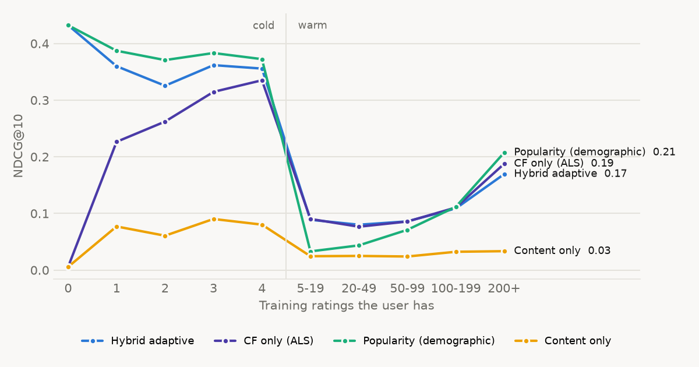

# Failure analysis - ml-1m

Generated by `python -m hybridrec evaluate`. The interpretation lives in REPORT.md.

## 1. Accuracy vs. how much history a user has (NDCG@10)

| history | users | Popularity (demographic) | Popularity | CF only (ALS) | Content only | Hybrid adaptive |
|---:|---:|---:|---:|---:|---:|---:|
| 0 | 121 | 0.4323 | 0.4143 | 0.0057 | 0.0057 | 0.4323 |
| 1 | 119 | 0.3872 | 0.3796 | 0.2265 | 0.0771 | 0.3599 |
| 2 | 119 | 0.3707 | 0.3557 | 0.2622 | 0.0607 | 0.3255 |
| 3 | 126 | 0.3832 | 0.3727 | 0.3146 | 0.0902 | 0.3618 |
| 4 | 119 | 0.3724 | 0.3575 | 0.3351 | 0.0803 | 0.3557 |
| 5-19 | 398 | 0.0330 | 0.0310 | 0.0903 | 0.0245 | 0.0888 |
| 20-49 | 1641 | 0.0436 | 0.0380 | 0.0766 | 0.0250 | 0.0801 |
| 50-99 | 1258 | 0.0711 | 0.0658 | 0.0857 | 0.0240 | 0.0860 |
| 100-199 | 1080 | 0.1117 | 0.1046 | 0.1105 | 0.0323 | 0.1088 |
| 200+ | 1020 | 0.2076 | 0.1983 | 0.1878 | 0.0334 | 0.1695 |

Average trust the adaptive hybrid puts in each signal at each history level (averaged over movies in proportion to how often they are watched; the three add up to 1):

| history | cf weight | content weight | popularity weight |
|---:|---:|---:|---:|
| 0 | 0.000 | 0.000 | 1.000 |
| 1 | 0.019 | 0.032 | 0.950 |
| 2 | 0.036 | 0.060 | 0.904 |
| 3 | 0.053 | 0.086 | 0.861 |
| 4 | 0.068 | 0.110 | 0.822 |
| 5-19 | 0.165 | 0.238 | 0.596 |
| 20-49 | 0.310 | 0.369 | 0.321 |
| 50-99 | 0.413 | 0.419 | 0.169 |
| 100-199 | 0.482 | 0.431 | 0.087 |
| 200+ | 0.504 | 0.432 | 0.065 |

## 2. Popularity bias: head vs. long tail

Head = the 388 most-watched movies that hold half of all training ratings; tail = the other 3495. 39% of the relevant test movies are head movies.

| model | recall on head movies | recall on long-tail movies | share of recs from head |
|---:|---:|---:|---:|
| Popularity (demographic) | 0.0972 | 0.0000 | 0.9998 |
| CF only (ALS) | 0.0879 | 0.0022 | 0.9328 |
| Hybrid adaptive | 0.0980 | 0.0014 | 0.9639 |
| Hybrid adaptive + MMR re-rank | 0.1001 | 0.0014 | 0.9686 |

## 3. Users with unusual taste (warm users, by mainstreamness quintile)

| group | users | mainstream | ndcg | recall |
|---:|---:|---:|---:|---:|
| 1 most niche | 1080 | 0.7844 | 0.1095 | 0.0525 |
| 2 | 1079 | 0.8451 | 0.1101 | 0.0544 |
| 3 | 1079 | 0.8734 | 0.1049 | 0.0568 |
| 4 | 1079 | 0.8987 | 0.1016 | 0.0658 |
| 5 most mainstream | 1080 | 0.9306 | 0.0977 | 0.0871 |

## 4. Genres the hybrid misses (recall of relevant movies per genre, lowest first)

| genre | relevant_pairs | recall | share_of_relevant | share_of_recommendations |
|---:|---:|---:|---:|---:|
| Documentary | 1625 | 0.0006 | 0.0045 | 0.0001 |
| Western | 4893 | 0.0047 | 0.0136 | 0.0010 |
| Horror | 10881 | 0.0147 | 0.0303 | 0.0122 |
| Musical | 8058 | 0.0153 | 0.0224 | 0.0064 |
| Animation | 7894 | 0.0203 | 0.0220 | 0.0122 |
| Mystery | 6970 | 0.0212 | 0.0194 | 0.0086 |
| Children's | 12341 | 0.0246 | 0.0343 | 0.0217 |
| Film-Noir | 3592 | 0.0309 | 0.0100 | 0.0066 |
| Comedy | 61131 | 0.0357 | 0.1700 | 0.1382 |
| Romance | 26118 | 0.0417 | 0.0726 | 0.0573 |
| Crime | 13768 | 0.0444 | 0.0383 | 0.0398 |
| Drama | 68821 | 0.0461 | 0.1914 | 0.1916 |
| Thriller | 32382 | 0.0507 | 0.0901 | 0.0862 |
| Fantasy | 5959 | 0.0747 | 0.0166 | 0.0177 |
| Action | 38229 | 0.0820 | 0.1063 | 0.1563 |
| Adventure | 19611 | 0.0885 | 0.0545 | 0.0780 |
| Sci-Fi | 24010 | 0.0929 | 0.0668 | 0.1011 |
| War | 13223 | 0.0960 | 0.0368 | 0.0649 |

## 5. Cold users whose few ratings are dislikes

| their ratings | users | ndcg |
|---:|---:|---:|
| mostly dislikes (<3) | 81 | 0.3302 |
| lukewarm (3-4) | 183 | 0.3387 |
| mostly likes (>=4) | 219 | 0.3687 |

## 6. Content features ablation (content-only model, cold-item slice)

| content features | ndcg@10 on cold items |
|---:|---:|
| all blocks | 0.0498 |
| genres only | 0.0511 |
| without decade | 0.0447 |
| without title/tag text | 0.0554 |

## 7. Cold movies the hybrid struggles to surface

Among cold movies with the most fans in the test period. Hit rate = share of those fans who got the movie in their top 10 cold-movie list.

- **A Few Good Men (1992)** (Crime, Drama) - 3 training ratings, 764 fans, hit rate 0%. Nearest by content: Phoenix (1998); Donnie Brasco (1997); GoodFellas (1990)
- **Top Gun (1986)** (Action, Romance) - 0 training ratings, 622 fans, hit rate 0%. Nearest by content: Excalibur (1981); Breathless (1983); The Jewel of the Nile (1985)
- **Bound (1996)** (Crime, Drama, Romance, Thriller) - 0 training ratings, 394 fans, hit rate 0%. Nearest by content: The Professional (a.k.a. Leon: The Professional) (1994); A Simple Plan (1998); Fargo (1996)
- **Body Heat (1981)** (Crime, Thriller) - 0 training ratings, 389 fans, hit rate 0%. Nearest by content: The Postman Always Rings Twice (1981); F/X (1986); Someone to Watch Over Me (1987)
- **Waiting for Guffman (1996)** (Comedy) - 1 training ratings, 372 fans, hit rate 0%. Nearest by content: I Got the Hook Up (1998); The Dinner Game (Le Dîner de cons) (1998); Mallrats (1995)
- **Sling Blade (1996)** (Drama, Thriller) - 0 training ratings, 981 fans, hit rate 0%. Nearest by content: Some Folks Call It a Sling Blade (1993); Gloria (1999); Crash (1996)

## 8. Worst cold-user cases

**User 727** (139 liked movies in test)

- Training history: Stripes (1981) - 3 stars; An Ideal Husband (1999) - 5 stars
- Hybrid recommended: Ghostbusters (1984); Shakespeare in Love (1998); Being John Malkovich (1999); Election (1999); Galaxy Quest (1999)
- Actually liked (most popular first): Saving Private Ryan (1998); Back to the Future (1985); The Silence of the Lambs (1991); Braveheart (1995); Schindler's List (1993)

**User 998** (116 liked movies in test)

- Training history: E.T. the Extra-Terrestrial (1982) - 5 stars; The Butcher's Wife (1991) - 3 stars
- Hybrid recommended: Star Wars: Episode V - The Empire Strikes Back (1980); Star Wars: Episode IV - A New Hope (1977); Star Wars: Episode VI - Return of the Jedi (1983); Back to the Future (1985); Raiders of the Lost Ark (1981)
- Actually liked (most popular first): American Beauty (1999); Saving Private Ryan (1998); The Matrix (1999); The Silence of the Lambs (1991); Fargo (1996)

**User 2261** (113 liked movies in test)

- Training history: The Edge (1997) - 3 stars; Good Morning, Vietnam (1987) - 4 stars
- Hybrid recommended: Platoon (1986); Ferris Bueller's Day Off (1986); Lethal Weapon (1987); Ghostbusters (1984); Big (1988)
- Actually liked (most popular first): American Beauty (1999); Jurassic Park (1993); Saving Private Ryan (1998); Terminator 2: Judgment Day (1991); The Silence of the Lambs (1991)
