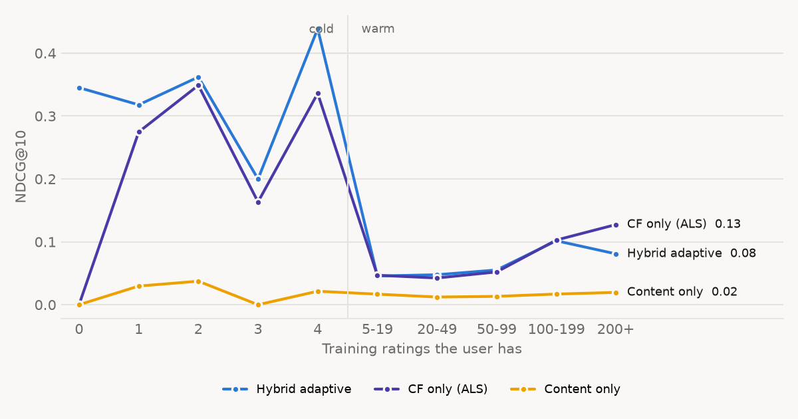

# Failure analysis - ml-latest-small

Generated by `python -m hybridrec evaluate`. The interpretation lives in REPORT.md.

## 1. Accuracy vs. how much history a user has (NDCG@10)

| history | users | Popularity | CF only (ALS) | Content only | Hybrid adaptive |
|---:|---:|---:|---:|---:|---:|
| 0 | 10 | 0.3452 | 0.0000 | 0.0000 | 0.3452 |
| 1 | 12 | 0.3142 | 0.2747 | 0.0296 | 0.3179 |
| 2 | 13 | 0.3516 | 0.3489 | 0.0374 | 0.3621 |
| 3 | 13 | 0.2003 | 0.1634 | 0.0000 | 0.1998 |
| 4 | 13 | 0.4150 | 0.3360 | 0.0214 | 0.4388 |
| 5-19 | 123 | 0.0374 | 0.0468 | 0.0168 | 0.0456 |
| 20-49 | 181 | 0.0307 | 0.0425 | 0.0122 | 0.0477 |
| 50-99 | 103 | 0.0489 | 0.0521 | 0.0133 | 0.0552 |
| 100-199 | 65 | 0.0971 | 0.1028 | 0.0170 | 0.1017 |
| 200+ | 73 | 0.0979 | 0.1274 | 0.0196 | 0.0808 |

Average trust the adaptive hybrid puts in each signal at each history level (averaged over movies in proportion to how often they are watched; the three add up to 1):

| history | cf weight | content weight | popularity weight |
|---:|---:|---:|---:|
| 0 | 0.000 | 0.000 | 1.000 |
| 1 | 0.003 | 0.032 | 0.964 |
| 2 | 0.007 | 0.062 | 0.931 |
| 3 | 0.010 | 0.090 | 0.900 |
| 4 | 0.013 | 0.116 | 0.871 |
| 5-19 | 0.031 | 0.277 | 0.692 |
| 20-49 | 0.058 | 0.504 | 0.438 |
| 50-99 | 0.077 | 0.658 | 0.265 |
| 100-199 | 0.090 | 0.758 | 0.152 |
| 200+ | 0.094 | 0.788 | 0.118 |

## 2. Popularity bias: head vs. long tail

Head = the 534 most-watched movies that hold half of all training ratings; tail = the other 9208. 20% of the relevant test movies are head movies.

| model | recall on head movies | recall on long-tail movies | share of recs from head |
|---:|---:|---:|---:|
| CF only (ALS) | 0.0955 | 0.0000 | 0.9835 |
| Hybrid adaptive | 0.0959 | 0.0004 | 0.9457 |
| Hybrid adaptive + MMR re-rank | 0.0974 | 0.0003 | 0.9531 |

## 3. Users with unusual taste (warm users, by mainstreamness quintile)

| group | users | mainstream | ndcg | recall |
|---:|---:|---:|---:|---:|
| 1 most niche | 109 | 0.8176 | 0.0528 | 0.0136 |
| 2 | 109 | 0.8900 | 0.0672 | 0.0187 |
| 3 | 109 | 0.9225 | 0.0564 | 0.0172 |
| 4 | 109 | 0.9520 | 0.0700 | 0.0312 |
| 5 most mainstream | 109 | 0.9841 | 0.0514 | 0.0434 |

## 4. Genres the hybrid misses (recall of relevant movies per genre, lowest first)

| genre | relevant_pairs | recall | share_of_relevant | share_of_recommendations |
|---:|---:|---:|---:|---:|
| Horror | 1449 | 0.0000 | 0.0231 | 0.0004 |
| Film-Noir | 211 | 0.0000 | 0.0034 | 0.0001 |
| Documentary | 288 | 0.0000 | 0.0046 | 0.0000 |
| Western | 399 | 0.0075 | 0.0064 | 0.0027 |
| Mystery | 2074 | 0.0092 | 0.0331 | 0.0078 |
| Musical | 776 | 0.0103 | 0.0124 | 0.0089 |
| Fantasy | 2392 | 0.0184 | 0.0382 | 0.0321 |
| Romance | 4122 | 0.0184 | 0.0659 | 0.0446 |
| Children | 1673 | 0.0203 | 0.0267 | 0.0287 |
| Animation | 1527 | 0.0223 | 0.0244 | 0.0284 |
| Drama | 10956 | 0.0229 | 0.1750 | 0.1555 |
| Comedy | 7348 | 0.0234 | 0.1174 | 0.1154 |
| Sci-Fi | 4135 | 0.0259 | 0.0661 | 0.0615 |
| Action | 7018 | 0.0264 | 0.1121 | 0.1349 |
| Thriller | 6108 | 0.0265 | 0.0976 | 0.1161 |
| IMAX | 888 | 0.0270 | 0.0142 | 0.0199 |
| Adventure | 5422 | 0.0293 | 0.0866 | 0.1293 |
| War | 1442 | 0.0347 | 0.0230 | 0.0258 |
| Crime | 4368 | 0.0373 | 0.0698 | 0.0877 |

## 5. Cold users whose few ratings are dislikes

| their ratings | users | ndcg |
|---:|---:|---:|
| mostly dislikes (<3) | 9 | 0.3672 |
| lukewarm (3-4) | 15 | 0.3665 |
| mostly likes (>=4) | 27 | 0.2971 |

## 6. Content features ablation (content-only model, cold-item slice)

| content features | ndcg@10 on cold items |
|---:|---:|
| all blocks | 0.0212 |
| genres only | 0.0149 |
| without decade | 0.0081 |
| without title/tag text | 0.0285 |

## 7. Cold movies the hybrid struggles to surface

Among cold movies with the most fans in the test period. Hit rate = share of those fans who got the movie in their top 10 cold-movie list.

- **Schindler's List (1993)** (Drama, War) - 4 training ratings, 171 fans, hit rate 0%. Nearest by content: The Messenger: The Story of Joan of Arc (1999); The Pianist (2002); The Tuskegee Airmen (1995)
- **The Usual Suspects (1995)** (Crime, Mystery, Thriller) - 2 training ratings, 161 fans, hit rate 0%. Nearest by content: The Spanish Prisoner (1997); Primal Fear (1996); Switchback (1997)
- **Raiders of the Lost Ark (Indiana Jones and the Raiders of the Lost Ark) (1981)** (Action, Adventure) - 3 training ratings, 160 fans, hit rate 0%. Nearest by content: Indiana Jones and the Last Crusade (1989); Raiders of the Lost Ark: The Adaptation (1989); MacGyver: Lost Treasure of Atlantis (1994)
- **The Godfather (1972)** (Crime, Drama) - 2 training ratings, 156 fans, hit rate 0%. Nearest by content: The Godfather: Part II (1974); Goodfellas (1990); Donnie Brasco (1997)
- **American Beauty (1999)** (Drama, Romance) - 0 training ratings, 152 fans, hit rate 0%. Nearest by content: How to Make an American Quilt (1995); The American President (1995); Inventing the Abbotts (1997)
- **The Sixth Sense (1999)** (Drama, Horror, Mystery) - 1 training ratings, 125 fans, hit rate 0%. Nearest by content: U Turn (1997); Beyond Bedlam (1993); Awakenings (1990)

## 8. Worst cold-user cases

**User 563** (51 liked movies in test)

- Training history: Forrest Gump (1994) - 4 stars; The King's Speech (2010) - 4 stars; Intouchables (2011) - 3.5 stars
- Hybrid recommended: The Shawshank Redemption (1994); Pulp Fiction (1994); Star Wars: Episode IV - A New Hope (1977); Fight Club (1999); Apollo 13 (1995)
- Actually liked (most popular first): Aladdin (1992); Beauty and the Beast (1991); Willy Wonka & the Chocolate Factory (1971); The Breakfast Club (1985); Casablanca (1942)

**User 371** (35 liked movies in test)

- Training history: Batman Returns (1992) - 3.5 stars; Starship Troopers (1997) - 4 stars; Rushmore (1998) - 5 stars; Lost in Translation (2003) - 5 stars
- Hybrid recommended: Forrest Gump (1994); Pulp Fiction (1994); The Shawshank Redemption (1994); Fight Club (1999); Star Wars: Episode IV - A New Hope (1977)
- Actually liked (most popular first): The Lord of the Rings: The Fellowship of the Ring (2001); Batman (1989); Eternal Sunshine of the Spotless Mind (2004); A Clockwork Orange (1971); 2001: A Space Odyssey (1968)

**User 291** (24 liked movies in test)

- Training history: Iron Man (2008) - 4 stars; Iron Man 2 (2010) - 4 stars; Iron Man 3 (2013) - 4 stars
- Hybrid recommended: Star Wars: Episode IV - A New Hope (1977); Forrest Gump (1994); The Shawshank Redemption (1994); Pulp Fiction (1994); Jurassic Park (1993)
- Actually liked (most popular first): Toy Story (1995); Harry Potter and the Sorcerer's Stone (a.k.a. Harry Potter and the Philosopher's Stone) (2001); Harry Potter and the Chamber of Secrets (2002); Up (2009); WALL·E (2008)
